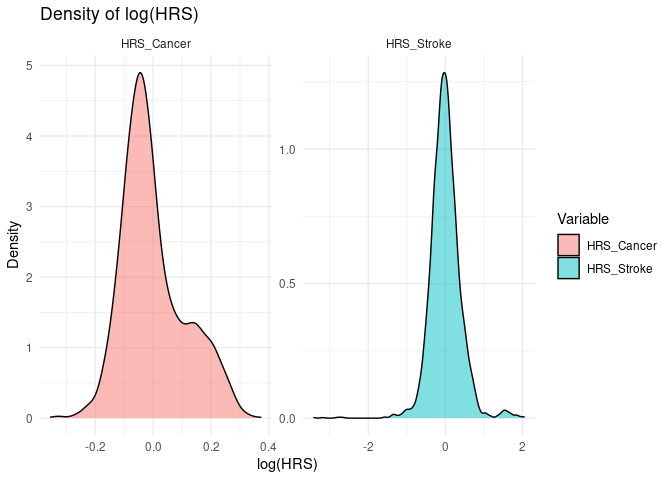
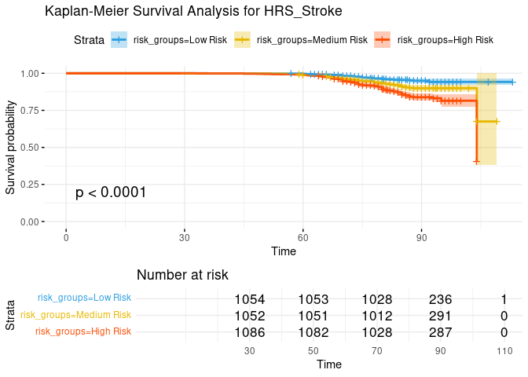
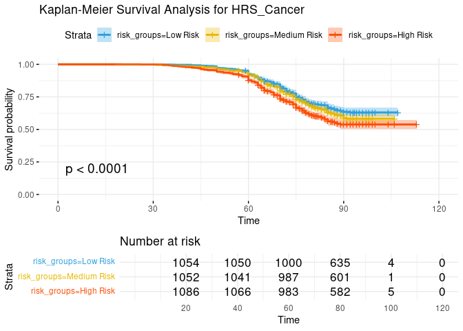

### Authors and Affiliations

<sup>1</sup> **Bioinformatics Program, Boston University, Boston, MA,
United States**  
<sup>2</sup> **Tufts Medical Center, Tufts Clinical and Translational
Science Institute, Boston, MA, United States**  
<sup>3</sup> **Tufts Medical Center, Center for Quantitative Methods and
Data Science, Boston, MA, United States**

## Summary

Multi-omics data analysis presents significant challenges due to the
**high dimensionality** of features, making it computationally intensive
and difficult to interpret. We introduce an open-source software that
integrates the **Cox Proportional Hazards Model** with **elastic net
regularization** to derive **Hazard Risk Scores (HRS)** from omics data.
These scores provide a **single-value summary** of an individual’s
relative risk for a given phenotype, akin to **Polygenic Risk Scores
(PRS)** in genetics, integrating time-to-event data.

Our software:

-   **Automates the fitting** of elastic net-regularized Cox models  
-   **Performs a greedy search** for optimal regularization parameters  
-   **Computes HRS** based on model coefficients  
-   **Includes visualization tools** for HRS distributions and
    Kaplan-Meier survival analysis

Designed for bioinformatics researchers and students, our software
offers a streamlined and reproducible approach to multi-omics survival
analysis.

------------------------------------------------------------------------

## Statement of Need

A major challenge in multi-omics research is the high number of
molecular features in datasets, which complicates statistical modeling,
interpretation, and reproducibility. Traditional approaches often
struggle to identify meaningful biological patterns without overfitting.

To address this, we present a computational framework that reduces
dimensionality by summarizing omics features into **phenotypic Hazard
Risk Scores (RS)** using a **Cox Proportional Hazards Model with elastic
net regularization** and time-to-event data.

### Key Advantages

-   **Automated Hyperparameter Tuning**  
    We implement a greedy search to optimize elastic net parameters,
    ensuring robust and reproducible model selection.

-   **Dimensionality Reduction**  
    RS condenses high-dimensional omics data into a single,
    interpretable value per individual, improving model performance and
    reducing overfitting.

-   **Survival Analysis Integration**  
    The pipeline links molecular features to time to event data via Cox
    Proportional Hazard models, providing intuitive risk stratification.

------------------------------------------------------------------------

This software is designed for bioinformatics researchers and students
who need a reproducible, scalable, and interpretable method to analyze
survival-related omics data.

## Mathematics

Elastic net is a regularization technique that combines both L1 (lasso)
and L2 (ridge) penalties \[1\]. It helps prevent overfitting by
encouraging sparsity (with L1) and smoothness (with L2) in the model as
well as disregarding highly correlated features which is a common
problem in the omics datasets. The coefficients estimated by the elastic
net are used to model the relationships between the features and the
survival outcome through the risk score.

The **Hazard Risk Score (HRS)** for an individual *i* is computed as:

$$
HRS_i ∝ exp(\sum\_{j=1}^{n} \beta_j x\_{ij})
$$

where:

-   *x*<sub>*i**j*</sub> represents the value of the *j*-th feature for
    subject *i*.
-   *β*<sub>*j*</sub> are the coefficients corresponding to each feature
    *j*, derived from the **elastic net Cox model**.

This **(HRS)** can then be used to predict an individual’s likelihood of
experiencing an event, such as **condition, disease, or other survival
outcomes**. A **higher RS value** indicates a **higher predicted risk**
for the individual.

The input omics data should be scaled and log-normalized.

## Examples

We demonstrate the computation of Cox Elastic Net–based Hazard Risk
Scores (HRS) for cancer and stroke using a synthetic dataset that
includes proteomics data and mixed clinical information from 3,193
subjects. To perform this analysis, the following variables are required
(illustrated here with cancer as an example):

–Health_Cancer: A binary status variable indicating whether the subject
was diagnosed with cancer (“Yes”) or not (“No”);

–Health_Cancer_Age: The age at cancer diagnosis;

–Age_last: The subject’s age at the last follow-up;

–x: Any high-dimensional omics dataset (e.g., proteomics, metabolomics,
transcriptomics).

### **Prepare the Data**

``` r
library(glmnet)
library(survival)
library(ggplot2)
source('Functions.R')
```

``` r
# Read the data
data <- read.csv("synthetic_data.csv")

# Select omics data
x <- data[1:56]
# Prepare omics data (normalize and log transform)
x <- prepare_data(x)

# Create survival models
surv_models <- create_surv_models(data, pheno_names = c("Stroke", "Cancer"))
```

### **Perform Cox Elastic Net Regression**

``` r
# Perform Cox Elastic Net Regression
cox_elastic_output <- optimize_cox_elastic_net(surv_models, x, alpha_values = seq(0, 1, by = 0.1))
```

    ## Processing Stroke 
    ## Testing alpha = 0 
    ## Testing alpha = 0.1 
    ## Testing alpha = 0.2 
    ## Testing alpha = 0.3 
    ## Testing alpha = 0.4 
    ## Testing alpha = 0.5 
    ## Testing alpha = 0.6 
    ## Testing alpha = 0.7 
    ## Testing alpha = 0.8 
    ## Testing alpha = 0.9 
    ## Testing alpha = 1 
    ## Best alpha for Stroke : 0.7 
    ## Best lambda for Stroke : 0.007426082 
    ## 
    ## Processing Cancer 
    ## Testing alpha = 0 
    ## Testing alpha = 0.1 
    ## Testing alpha = 0.2 
    ## Testing alpha = 0.3 
    ## Testing alpha = 0.4 
    ## Testing alpha = 0.5 
    ## Testing alpha = 0.6 
    ## Testing alpha = 0.7 
    ## Testing alpha = 0.8 
    ## Testing alpha = 0.9 
    ## Testing alpha = 1 
    ## Best alpha for Cancer : 0.6 
    ## Best lambda for Cancer : 0.02175306

### **Compute and Visualize Hazard Risk Scores (HRS)**

``` r
# Compute and visualize Hazard Risk Scores (HRS)
HRS_df <- compute_HRS(x, cox_elastic_output)
```

    ## Processing HRS for Stroke 
    ## Processing HRS for Cancer

``` r
# Plot histograms, scatter plots or density plots
p<- visualize_HRS_df(HRS_df, plot_type = "density")
plot(p)
```



### **Perform Kaplan-Meier Survival Analysis**

``` r
# Perform Kaplan-Meier survival analysis
km_plots <- compute_km_analysis(HRS_df, data)
```

    ## Kaplan-Meier analysis for HRS_Stroke 
    ## Kaplan-Meier analysis for HRS_Cancer

### **Display Kaplan-Meier Plots**

``` r
# Display Kaplan-Meier survival
plot_all_km_results(km_plots)
```

    ## Displaying Kaplan-Meier plot for HRS_Stroke



    ## Displaying Kaplan-Meier plot for HRS_Cancer



# References

1.  Zou, H., & Hastie, T. (2005). Regularization and variable selection
    via the elastic net. Journal of the Royal Statistical Society:
    Series B (Statistical Methodology), 67(2), 301-320.
    <https://doi.org/10.1111/j.1467-9868.2005.00503.x>
